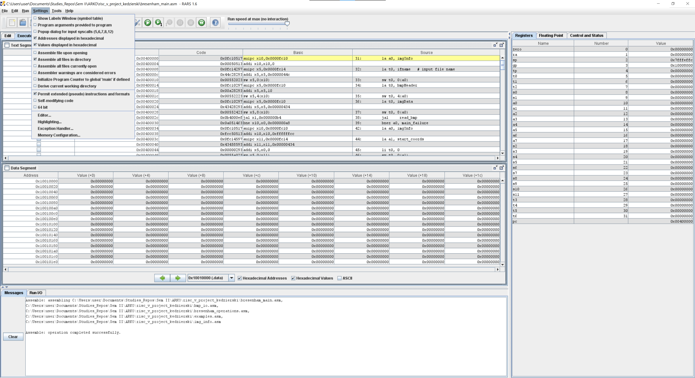
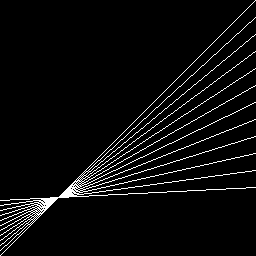
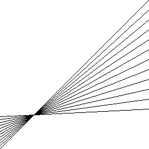

# bresenham
## Description
`Assembly` implementation of **Bresenham's line algorithm** for different platforms:
- `RISC-V`
- `x86-32`
- `x86-64`

It was written in the second semester (2023L) as a project for the course *Computer architecture (ARKO)* at the Warsaw University of Technology.

## RISC-V
Program can be launched in [RARS](https://github.com/TheThirdOne/rars) simulator.

Make sure to assemble all files in the directory before running the program

### Example results:
    

