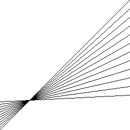
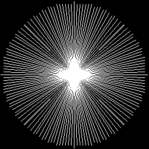
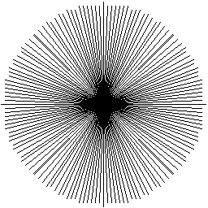

# bresenham
## Description
`Assembly` implementation of **Bresenham's line drawing algorithm** for different platforms:
- `RISC-V`
- `x86-32`
- `x86-64`

It was written in the second semester (2023L) as a project for the course *Computer architecture (ARKO)* at the Warsaw University of Technology.

## RISC-V
Program can be launched in [RARS](https://github.com/TheThirdOne/rars) simulator.

Make sure to assemble all files in the directory before running the program (check *Assemble all files in directory* option in Settings menu).


### Example results:
    

## x86
For both x86-32 and x86-64, steps to run the program are the same:
1. Install prerequisites (for Ubuntu)
    ```
    sudo apt install gcc gcc-multilib nasm make
    ```
2. Compile program
    ```
    make all
    ```
3. Run program
    ```
    ./dline
    ```
4. Clean up
    ```
    make clean
    ```

### Example results:
    
